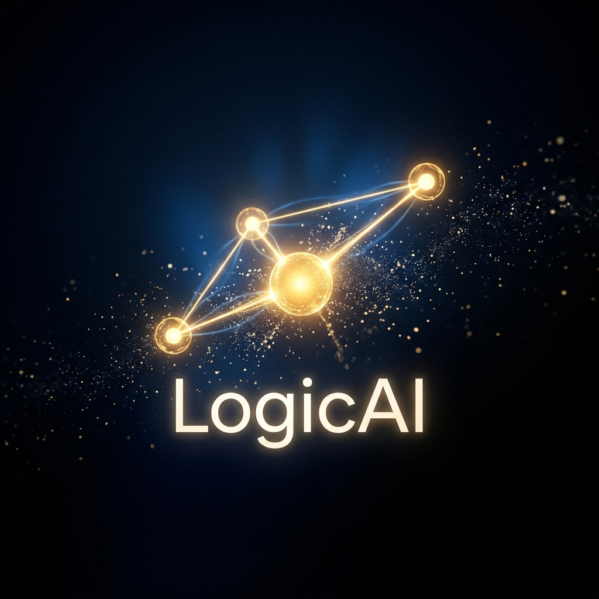

用了将近一年的各种 AI 工具之后，我开始意识到一件事：

**我每次开始对话，都要重新介绍自己。**

告诉它我在做什么项目，告诉它我的技术栈，告诉它我的偏好和习惯。然后对话结束，它忘了。下次再来，一切归零。

这不是它的错——这就是它被设计的方式。大多数 AI 助手是无状态的：每次对话独立，干净，但也因此浅薄。

我开始想：**如果有一个 AI，它真的了解我呢？**

---

## 一条推文打开了一扇门

这个问题真正变得具体，是因为我看到了一条推文。

作者用几句话描述了一个工具——**OpenClaw**。它能接管你的终端，操控电脑，帮你处理各种任务。不是在对话框里给建议，而是直接动手。

还有一条让我眼睛一亮：**它有记忆，能记住用户的喜好。**

就是这个。就是我在开头说的那件事——每次对话都要重新介绍自己的那个问题。这里突然有一个东西说它能解决。

我看完之后，脑子里有什么东西松动了。

然后我开始停不下来地往前想：

如果它能控制终端，那是不是也能控制其他设备？把这套东西写进硬件里，家里每一台设备都变成真正"智能"的——不是靠语音指令的那种弱智能，而是能理解你在做什么、主动帮你处理事情的那种。再往前一步：智能宠物，不是预设动作的机械玩具，而是真正能和你互动的存在。再往前：配合机器人的发展，配合专为机器人优化的 AI 模型，机械智能成为可能。科幻里那些场景——机甲战斗、人机协作——忽然不再是遥远的幻想，而是一条能看到节点的路。

当时我就觉得：**这件事要发生了。**

于是我花了一两个月的时间沉进去研究 OpenClaw，越研究越想从根本上改造它。

---

## 盲盒

刚开始的时候，我还是个技术小白。

我以为改造一个智能体很简单——跟它对话，告诉它我想要什么，它就会进化成我想要的样子。我当时的设想很大：让它不断掌握新技能，让它自我进化，让它越来越懂我。

但随着使用的深入，我撞上了一堵墙。

我能做的改造，只局限在 OpenClaw 自己设计的边界内。它允许你调整什么，你才能调整什么。我不懂它的底层代码，不理解它的运作机制，就像在一个预设好的房间里重新摆家具——家具的种类，房间的结构，都不是你说了算的。

更让我抓狂的是：它会出错，但你不知道错在哪里。

有时候你交代它去做一件事，它回复"好的，已经完成了"，但什么都没发生。你不知道这是模型本身的幻觉，还是 OpenClaw 的设计缺陷，还是你的指令没有表达清楚。一个黑盒子，出了问题，你只能猜。

两个月之后，我想明白了一件事：

**当你操作的智能体是个盲盒，而你又无法改造它时，它就永远无法成为你的专属智能体，也无法和你产生真正的羁绊。**

---

## 社区的沉寂，和一个新词

OpenClaw 爆火之后，大量玩家涌进来。大家一起探索，一起折腾，热闹了一段时间。

然后慢慢地，讨论变少了。那些当初和我一样兴奋的人，一个个安静下来。大家玩着玩着，放弃了。

我理解这种放弃。我自己就是从那里走过来的——技术有限，想做的事做不到，盲盒问题无法解决，热情会自然冷却。

那段时间我也陷入了一种悬空的状态：知道自己想要什么，但不知道从哪下手。想自己做一个智能体，但连"从哪里开始"都是一个问题，更别说动手了。

后来，社区里开始出现两个词被反复提及：**Claude**、**Codex**。有人说用它们写代码效率高得吓人，有人说它们才是真正能用的编码智能体。

那时候我一直在用 **Google Antigravity**——Google 的 AI 原生 IDE，界面对新手友好，用起来顺手，没动力去换。但随着这两个名字出现得越来越频繁，我意识到：

**我应该去主动探索这类编码智能体，看看它们能做到什么。**

这个决定，改变了后来的一切。

---

## AI 是你思维的延伸

接触了 Claude Code、Codex、Google Antigravity 之后，有件事让我有点意外：我开始能做东西了。

不是那种"AI 帮我写了个 hello world"的程度——是真的能从零设计、从零实现一个我自己需要的工具。教案生成、PPT 制作，一些以前完全不会碰的事情，忽然变得可以动手了。

我开始膨胀，觉得可以更进一步。

当时我在读研，最迫切的需求是一个科研智能体——能帮我整理文献、梳理论文思路、辅助写作的那种。想法很美好，我也真的开始做了。

但很快我就撞上了一个事实：

**AI 的能力，取决于你自己的能力。它是你思维和行动的延伸，而不是替代品。**

科研这件事，我思考得太少了。我不知道一篇好论文的结构应该是什么，不知道文献综述的逻辑该怎么组织，不知道研究问题该如何提炼。当我什么都没有的时候，AI 也无从延伸。

所以这个项目死掉了。不是技术问题，是我自己的问题。

但关于"专属智能体"的那个念头，没有死。我对科研思考得少，但我对自主智能体想得很深——这才是我真正该做的东西。

---

## 世界在给你机会

当你在努力的时候，世界都在给你机会。

在我开始着手做专属智能体的时候，一开始是根据 OpenClaw 的开源项目学习，吸收它的设计理念，借鉴并改造。好巧不巧的是，Claude Code 的源码泄露了。还记得当时我认真迅速地把源码保留下来，深怕晚一秒就找不见了。

插个题外话——后面见多了，才后知后觉：这是不是 Anthropic 惯用的营销手段？只觉得有趣。

切回正题。源码的泄露使得大家对智能体的热情高涨，纷纷猜测国内又将如何涌现大批代码智能体，再现"遥遥领先"的盛况。

不过，这一切与我无关。我已经投入到源码的探索中了。

学习一项技术确实很困难，尤其是其中的技术栈你并不了解。所以就只能喂给 Claude Code、Antigravity 等这几个智能体，和它们一块研究，再配合相应的讲解文章，我还是学到了不少东西。

有了这些，我终于可以真正开始了。但开始之前，我先要做一个决定。

摆在我面前的有两条路。

一条是套用已有的框架——LangChain、LangGraph。这两个是成熟的智能体开发框架，底层的模型调用、工具编排、状态管理都帮你封装好了，在上面不断补充细节、丰富功能，智能体就能跑起来。快，省事，社区资源也多。

另一条是从头开始搭，按照自己的思维和想法，一个个去实现功能，搞清楚为什么会需要这个设计，为什么会需要这个功能。每一行代码都是自己写的，每一个决策都是自己做的。好处是：我能清晰知道每个功能有没有必要存在，对它的设计有掌控——而不是让 AI 再给我生成一个盲盒。

最终我还是选择了后者。

因为我需要学习，需要搞懂，需要掌控。

---

## LogicAI

在解决了一系列困难之后，我的专属智能体终于像 OpenClaw 一样，成功运转在了我的手机上。

我给它起名叫 **LogicAI**。至于为什么叫这个名字，等我把完整的 agent 开发讲完，大家自然就懂了。

LogicAI 的设计理念很朴素：**专业的事情交给专业的人来做。** 这也和我非常喜欢的帝王刘邦不谋而合——他不需要样样精通，只需要知道每件事该交给谁。

我不需要把所有的事情压给一个 agent，只需要为每一类事务挑选最合适的 agent 来完成，再让它们之间彼此通信、协作。同时，我希望每一个 agent 的设计都遵循同一套模板——这样每次想增加新的专业 agent，只需要按照同样的流程制作就行，不用从零重新设计。

最初，我设计了**刘邦**作为主 agent，分设**张良、韩信、萧何**作为子 agent，分别负责计划、执行与审计。

那一刻我是开心的，但开心很短暂。我很快意识到，我能做的事情要远比这多得多——所有的想法，我要将它们一一实现。

---

从下一篇开始，我们正式介绍 LogicAI——从最初的简单对话，到 agent 逐步接管生活的方方面面。

---

## 我对未来的一些设想

搭建自己智能体的过程中，我一直在想一个更大的问题：这件事最终会走向哪里？

**首先，未来肯定是工具极大丰富的时代。**

AI 使得工具的设计成本变得极为低廉。以前开发一个工具需要一支团队、几个月时间；现在一个人、几天、一个想法就够了。这个趋势只会加速，不会逆转。

工具不再稀缺之后，考验人类的能力就不再是"会不会用某个工具"，而是**接触工具、驾驭工具的能力**。这种能力最终会落实到两件事上：思维逻辑和语言表达。你能不能把一个模糊的需求分析清楚，拆解成步骤，一步步推进完成——这才是核心竞争力。

再进一步，哪怕面对同一个问题，每个人交付的产物也不尽相同。这就涉及到另一个维度：**个人的品味和审美能力**。工具是平等的，但用工具做出来的东西，高下立判。

**再看 AI 这边，情况恰好相反。**

AI 使用工具其实相对简单——只要遵循对应的技术协议，工具调用层面的能力差距并不大。真正拉开差距的，是模型本身的能力，以及 agent 的 harness 架构设计——也就是这套系统是怎么被组织和编排的。而这个设计，又回到了人类的能力上。

所以兜了一圈，我得出一个结论：

**个人专属 agent，其实是个人的智能代表。**

它的上限，是你思维的上限。它的品味，折射出你的审美。它处理问题的方式，本质上是你处理问题方式的一种延伸和具现。

如果接受这个前提，那么有一些问题就值得重新考量了：人类与 agent 之间如何沟通，agent 与 agent 之间如何协作，这些范式都还没有被真正定义清楚。

这也是我想继续探索的方向。
