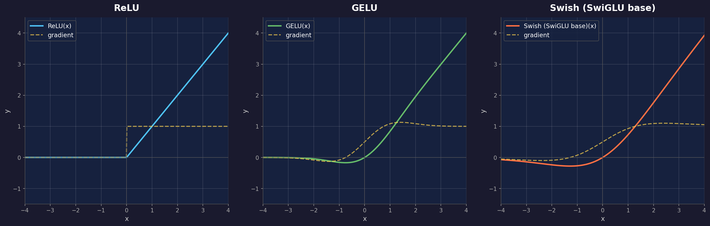

这是 **Transformer 原理系列**的第四篇。前三篇我们拆解了 Self-Attention、Multi-Head Attention 和位置编码——这些是 Transformer 最核心的创新。

本篇聚焦那些看似不起眼、却不可或缺的**基础组件**——没有它们，Transformer 根本无法训练。

---

## 回顾：每层 Encoder 的内部结构

第一篇我们给过这个流程图，现在逐个拆解：

```
输入向量 ──→ [ Self-Attention ] ──→ Add & Norm ──→ [ FFN ] ──→ Add & Norm ──→ 输出
              前三篇已拆解完           本篇重点         本篇重点     本篇重点
```

每层有四个关键组件：
1. **Self-Attention**（已讲）
2. **残差连接（Residual Connection）** —— "Add" 部分
3. **层归一化（Layer Normalization）** —— "Norm" 部分
4. **前馈网络（Feed-Forward Network, FFN）**

---

## 残差连接（Residual Connection）

### 深层网络的训练困境

Transformer 原始论文堆了 6 层 Encoder + 6 层 Decoder = 12 层。现代大模型更夸张——GPT-4 约 120 层，LLaMA 3 70B 有 80 层。

**为什么深层网络难训练？** 要回答这个问题，必须理解**反向传播的链式法则**。

### 梯度回传：链式法则的逐层连乘

> **梯度（Gradient）**：训练时告诉模型"参数该往哪个方向调、调多少"的信号。模型通过**损失函数**衡量"当前输出离正确答案有多远"，然后把这个误差信号从最后一层**反向逐层传回**每一层——这就是反向传播。

假设网络有 $L$ 层，每层是一个函数 $f_l$。前向传播是逐层嵌套：

$$
x_L = f_L(f_{L-1}(\cdots f_2(f_1(x_0)) \cdots))
$$

训练时，我们用一个**损失函数** $\mathcal{L}$ 来衡量"模型输出离正确答案有多远"。直觉上可以先理解为：

$$
\mathcal{L} = -\log P(\text{正确答案})
$$

比如模型预测下一个词是 "cat" 的概率为 0.3，而正确答案就是 "cat"，那么 $\mathcal{L} = -\log(0.3) \approx 1.2$。如果模型很自信地给出 0.95 的概率，$\mathcal{L} = -\log(0.95) \approx 0.05$——**概率越高，损失越小**。（具体公式下一篇展开，这里只需要知道它是一个标量——一个数字，越小越好。）

反向传播的目标就是算出 $\mathcal{L}$ 对每一层参数的梯度，然后沿梯度方向更新参数来减小损失。

现在要算 $\mathcal{L}$ 对第 $l$ 层输入 $x_l$ 的梯度，链式法则告诉我们：

$$
\frac{\partial \mathcal{L}}{\partial x_l} = \frac{\partial \mathcal{L}}{\partial x_L} \cdot \prod_{k=l+1}^{L} \frac{\partial f_k}{\partial x_{k-1}}
$$

**关键在那个连乘 $\prod$**。每经过一层，梯度要乘上那一层的**雅可比矩阵**（Jacobian） $J_k = \frac{\partial f_k}{\partial x_{k-1}}$。经过 $L - l$ 层后，梯度被乘了 $L - l$ 次。

这个连乘的行为完全取决于每层 Jacobian 的**谱范数**（最大奇异值） $\|J_k\|$：

### 何时梯度消失？

当大多数层的 $\|J_k\| < 1$ 时——每乘一次，梯度就被缩小一点。

```
假设每层 Jacobian 的谱范数 ≈ 0.9（梯度每层缩小到 90%）

经过 10 层：0.9¹⁰ ≈ 0.35     → 梯度只剩 35%
经过 50 层：0.9⁵⁰ ≈ 0.0052   → 梯度只剩 0.5%
经过 80 层：0.9⁸⁰ ≈ 0.00018  → 梯度几乎为零

→ 前面的层收到的梯度太小，参数几乎不更新
→ 模型的前几层永远学不会，模型等于"瘸腿"训练
```

**典型场景**：Sigmoid / Tanh 激活函数的导数最大值 < 1（Sigmoid 最大 0.25，Tanh 最大 1.0），加上权重矩阵的缩放效应，很容易让 $\|J_k\| < 1$。这就是早期深层 RNN/CNN 难训练的根本原因。

### 何时梯度爆炸？

当大多数层的 $\|J_k\| > 1$ 时——反过来，每乘一次梯度被放大。

```
假设每层 Jacobian 的谱范数 ≈ 1.1（梯度每层放大到 110%）

经过 10 层：1.1¹⁰ ≈ 2.6       → 还行
经过 50 层：1.1⁵⁰ ≈ 117       → 梯度已经爆了
经过 80 层：1.1⁸⁰ ≈ 2,048     → 梯度上千倍放大

→ 参数更新量巨大，权重一步跳到离谱的值
→ 下一步梯度更大 → 继续跳 → 训练直接 NaN 崩溃
```

**典型场景**：权重初始化不当（过大）、学习率过高、或者某些层的激活函数在特定区间导数 > 1 时容易触发。RNN 中尤其常见，因为同一个权重矩阵被重复乘了序列长度次。

### 本质：指数效应

消失和爆炸本质上是**同一个问题**——连乘的指数效应：

$$
\prod_{k=l+1}^{L} \|J_k\| \approx \bar{r}^{\,(L-l)}
$$

其中 $\bar{r}$ 是各层谱范数的几何平均。$\bar{r} < 1$ → 指数衰减（消失）；$\bar{r} > 1$ → 指数增长（爆炸）。只有精确地 $\bar{r} = 1$ 时梯度才稳定——但 $L$ 层网络要保证每层都恰好 $\|J_k\| = 1$ 几乎不可能。

> 用传话游戏来比喻：80 个人排成一列传话。如果每个人只能听清 90% 的内容（$\bar{r}=0.9$），到第 80 个人时信息就面目全非了——**这是梯度消失**。反过来，如果每个人传话时都越来越激动地夸大 10%（$\bar{r}=1.1$），到最后就变成了一个荒诞的故事——**这是梯度爆炸**。

### 解决方案：加一条"捷径"

残差连接的思路极其简单——**在每一层旁边加一条直通线路**，让输入可以"绕过"这一层直接到达输出：

$$
\text{output} = \text{Layer}(x) + x
$$

```
        ┌───────────────────────┐
        │                       │
输入 x ──┼──→ [ Self-Attention ] ──→ (+) ──→ 输出
        │                       ↑
        └───────────── 直通 ─────┘
                   （残差连接）
```

### 为什么残差连接能解决梯度问题？（数学推导）

有了残差连接后，每层变成 $x_{k} = f_k(x_{k-1}) + x_{k-1}$，其 Jacobian 变成：

$$
\frac{\partial x_k}{\partial x_{k-1}} = \frac{\partial f_k}{\partial x_{k-1}} + I
$$

那个 **$+I$（单位矩阵）** 就是关键。

现在从第 $L$ 层回传到第 $l$ 层的梯度变成：

$$
\frac{\partial \mathcal{L}}{\partial x_l} = \frac{\partial \mathcal{L}}{\partial x_L} \cdot \prod_{k=l+1}^{L} \left(\frac{\partial f_k}{\partial x_{k-1}} + I\right)
$$

把这个连乘展开（类似多项式展开），会得到 $2^{L-l}$ 条路径的加和：

$$
\prod_{k=l+1}^{L}(J_k + I) = I + \sum_{k} J_k + \sum_{j<k} J_j J_k + \cdots + \prod_{k} J_k
$$

**注意第一项是 $I$**——这意味着无论中间发生了什么，总有一条"全部走捷径"的路径让梯度**原封不动地直达**第 $l$ 层。其他 $2^{L-l}-1$ 条路径是锦上添花。

```
无残差连接：梯度只有 1 条路径 → 连乘 → 指数衰减/爆炸
                L₁ → L₂ → L₃ → ... → L₈₀  （80 次连乘）

有残差连接：梯度有 2⁸⁰ 条路径 → 加和 → 不再是纯连乘
                最短路径：直通（跳过所有层，梯度 = 1）
                其他路径：经过 1 层、2 层、...、80 层的各种组合
                
→ 即使"全经过"的路径消失了，"全跳过"的路径保证梯度至少为 1
→ 梯度不会消失！
```

> **传话游戏 + 微信版**：每个人不仅传话给下一个人，还同时发了一条微信给所有后面的人。即使传话内容变了，微信里的原文还在——第 80 个人可以直接翻微信看原话。

### 残差学习的本质

换一个视角理解。假设某一层的理想输出是 $H(x)$，传统网络让这一层直接学 $H(x)$。残差连接让这一层只需要学 **$F(x) = H(x) - x$**，即"输入和理想输出的差异"：

$$
\text{output} = F(x) + x = H(x)
$$

> **为什么学差异比学全量更容易？** 如果某一层什么都不做是最优的（$H(x) = x$），传统网络要学一个恒等变换（很难），残差网络只需要让 $F(x) = 0$（把所有权重推向零，很容易）。实际中，大多数层只需要做"微调"而非彻底重写，所以残差连接让每一层的学习任务变得更简单。

### 实际效果

| 配置 | 12 层 Transformer | 80 层 Transformer |
|------|-------------------|-------------------|
| 无残差连接 | 梯度消失，无法收敛 | 完全不可训练 |
| 有残差连接 | 正常训练 | 正常训练 |

> **残差连接不是 Transformer 发明的**——它来自 2015 年的 ResNet（残差网络），由何恺明等人提出，一举解决了 CNN 的深层训练问题，是深度学习历史上最重要的技巧之一。Transformer 直接借鉴了这个设计。

---

## 层归一化（Layer Normalization）

### 为什么需要归一化？

经过 Self-Attention 或 FFN（Feed-Forward Network，前馈网络，后文详述）后，不同维度的数值范围可能差异很大。**差异从哪来？** 主要三个来源：

1. **权重矩阵的列尺度不一**：$W^V$、$W^O$、$W_1$ 等权重矩阵的每一列对应输出的一个维度。训练过程中，不同列的权重大小自然不同——有的列权重大，输出的那个维度数值就大；有的列权重小，输出就小。
2. **Attention 的加权求和放大效应**：Self-Attention 的输出是 $\text{softmax}(QK^T/\sqrt{d_k}) \cdot V$ 的加权和。如果某个维度上多个 Value 向量的值都较大，加权求和后这个维度会被进一步放大；而另一个维度上 Value 值本来就小，求和后依然小。
3. **残差连接的累积**：每一层做 $x + \text{Layer}(x)$，经过多层后，某些维度可能被反复叠加放大，而另一些维度的贡献被抵消。层数越深，维度间的尺度差异越大。

```
某个词经过 Attention 后的向量：
[0.001, 52.3, -0.0003, 18.7, ...]

问题：
  - 数值范围跨越好几个数量级（0.001 到 52.3）
  - 下一层的权重很难同时处理这么大的差异
  - 梯度在不同维度上的更新步长差异巨大，训练不稳定
```

归一化的目标：**把向量的数值分布标准化到一个统一的范围**，让后续层更容易处理。

### LayerNorm 的计算

对一个向量 $x = [x_1, x_2, \ldots, x_d]$，LayerNorm 做三步：

**第一步：计算均值**

$$
\mu = \frac{1}{d}\sum_{i=1}^{d} x_i
$$

**第二步：计算方差**

$$
\sigma^2 = \frac{1}{d}\sum_{i=1}^{d}(x_i - \mu)^2
$$

**第三步：归一化 + 可学习的缩放和偏移**

$$
\text{LayerNorm}(x_i) = \gamma \cdot \frac{x_i - \mu}{\sqrt{\sigma^2 + \epsilon}} + \beta
$$

其中：
- $\gamma$（缩放）和 $\beta$（偏移）是可训练参数——让模型自己决定归一化后的最优分布
- $\epsilon$（极小值，通常 $10^{-5}$）防止除以零

### 具体例子

```
输入向量 x = [0.001, 52.3, -0.0003, 18.7]

第一步：均值 μ = (0.001 + 52.3 + (-0.0003) + 18.7) / 4 = 17.75

第二步：方差 σ² = ((0.001-17.75)² + (52.3-17.75)² + ...) / 4 ≈ 413.6
        标准差 σ ≈ 20.34

第三步：归一化
  x₁: (0.001 - 17.75) / 20.34 ≈ -0.87
  x₂: (52.3 - 17.75) / 20.34  ≈  1.70
  x₃: (-0.0003 - 17.75) / 20.34 ≈ -0.87
  x₄: (18.7 - 17.75) / 20.34 ≈  0.05

归一化后：[-0.87, 1.70, -0.87, 0.05]
→ 所有值都在合理范围内了！
```

### 📌 为什么是 LayerNorm 而不是 BatchNorm？

如果你了解 CNN，可能听过 **BatchNorm**（批归一化）。它在 CNN 中效果极好，为什么 Transformer 不用？

**BatchNorm** 是跨样本归一化——对一个 batch 中所有句子的**同一个位置**的**同一个维度**求均值和方差：

```
Batch 中有 32 个句子：
BatchNorm 计算：句子₁的第3个词的第5维 + 句子₂的第3个词的第5维 + ... 的均值

问题：
  ① 句子长度不同 → 第 20 个词在短句中不存在
  ② batch 太小或推理时 batch=1 → 统计量不稳定
  ③ 不同位置的词没有可比性（第 1 个词和第 10 个词的分布可能完全不同）
```

**LayerNorm** 是在单个样本内部归一化——对**同一个词**的**所有维度**求均值和方差：

```
LayerNorm 计算：某个词的 512 维向量内部的均值和方差

优势：
  ✅ 不依赖 batch 大小（推理时 batch=1 也没问题）
  ✅ 不依赖序列长度（每个词独立归一化）
  ✅ 同一个词的不同维度之间具有天然的可比性
```

| 对比 | BatchNorm | LayerNorm |
|------|-----------|-----------|
| 归一化方向 | 跨样本（batch 维度） | 跨特征（feature 维度） |
| 依赖 batch 大小 | 是 | **否** |
| 可变长序列 | 处理困难 | **天然支持** |
| 推理时 batch=1 | 需要维护移动平均 | **直接计算** |
| 适用场景 | CNN（固定尺寸输入） | **Transformer（可变长序列）** |

### Pre-Norm vs Post-Norm

原始 Transformer 论文把 LayerNorm 放在残差连接**之后**（Post-Norm）：

```
Post-Norm（原论文）：
x → Self-Attention → x + Attention(x) → LayerNorm → 输出

公式：LayerNorm(x + Sublayer(x))
```

但后来的实践发现，放在**之前**（Pre-Norm）训练更稳定：

```
Pre-Norm（现代主流）：
x → LayerNorm → Self-Attention → x + Attention(LN(x)) → 输出

公式：x + Sublayer(LayerNorm(x))
```

> **为什么 Pre-Norm 更好？** Post-Norm 中，残差连接的结果先经过了 Attention 变换，数值可能已经不稳定了，此时再归一化是"事后补救"。Pre-Norm 在进入 Attention 之前就归一化好了，确保输入始终在合理范围内，训练更稳定。GPT、LLaMA 等现代大模型都采用 Pre-Norm。

---

## 前馈网络（FFN）

### 角色：信息的"消化吸收"

在每层 Encoder/Decoder 中，Self-Attention 负责**收集信息**（让每个词看到其他词），FFN 负责**处理信息**（对每个词独立做非线性变换）。

> **类比**：Self-Attention 像开会收集各方意见，FFN 像会后每个人独立消化整理笔记。

### 结构

FFN 本质上就是两个线性层 + 一个激活函数，对**每个词独立**应用：

$$
\text{FFN}(x) = W_2 \cdot \sigma(W_1 \cdot x + b_1) + b_2
$$

其中：
- $W_1 \in \mathbb{R}^{d_{model} \times d_{ff}}$：第一层，升维
- $W_2 \in \mathbb{R}^{d_{ff} \times d_{model}}$：第二层，降维
- $\sigma$：激活函数（原论文用 ReLU，现代模型用 SwiGLU/GELU）

```
输入 (512维) → 升维 → (2048维) → 激活函数 → 降维 → (512维) → 输出
               W₁                 σ            W₂
           "展开分析"          "非线性"      "压缩总结"
```

### 为什么 $d_{ff} = 4 \times d_{model}$？

原始论文中 $d_{model} = 512$，$d_{ff} = 2048$，正好 4 倍。

**为什么要先升维再降维？** 直觉上：

```
输入 512 维 → 升到 2048 维 → 再降回 512 维

就像做分析：
  原始数据（512维）→ 展开成更细的维度（2048维），在更大的空间里做非线性变换
  → 压缩回原始维度（512维），提炼出关键信息
```

升维让模型有更多的"工作空间"来做复杂变换。如果直接在 512 维上操作，表达能力受限。

> **4 倍不是唯一选择**——LLaMA 使用 $d_{ff} = \frac{8}{3} d_{model}$（约 2.67 倍），因为 SwiGLU 激活函数有三个矩阵，需要调整倍率来保持总参数量不变。

### 激活函数的进化

**为什么需要激活函数？** 如果 FFN 只有线性变换（矩阵乘法 + 加偏置），两层线性变换的组合 $W_2(W_1 x + b_1) + b_2$ 仍然是一个线性变换——可以合并成单层 $W'x + b'$，两层和一层等价，深度毫无意义。激活函数引入**非线性**，让网络真正具备"深层叠加产生更强表达能力"的可能。

下面是 Transformer 历史上三代激活函数的演进，函数图像和梯度（虚线）如图所示：



---

#### ReLU（2012-2017，原始 Transformer 论文）

$$
\text{ReLU}(x) = \max(0, x) = \begin{cases} x & x > 0 \\ 0 & x \leq 0 \end{cases}
$$

**导数：**

$$
\text{ReLU}'(x) = \begin{cases} 1 & x > 0 \\ 0 & x \leq 0 \end{cases}
$$

```
x = -2.0  →  ReLU(-2.0) = 0      梯度 = 0  ← 完全死了，不更新
x = -0.1  →  ReLU(-0.1) = 0      梯度 = 0  ← 也死了
x =  0.5  →  ReLU(0.5)  = 0.5    梯度 = 1  ← 正常传梯度
x =  3.0  →  ReLU(3.0)  = 3.0    梯度 = 1  ← 正常
```

**优点**：计算极快（一个 `max` 操作），正区间梯度恒为 1，不会梯度消失。

**致命缺陷——神经元死亡（Dying ReLU）**：一旦某个神经元的输入变为负数，输出恒为 0，梯度也恒为 0。这意味着该神经元**永远不会再被更新**——它"死了"。在大规模训练中，可能有大量神经元陷入死区，模型有效容量严重下降。

> 从图中可以清楚看到：ReLU 在 $x=0$ 处有一个硬拐点，左半边函数值和梯度都是 0——信息在这里被**永久丢弃**。

---

#### GELU（2016，被 GPT / BERT 采用）

$$
\text{GELU}(x) = x \cdot \Phi(x)
$$

其中 $\Phi(x)$ 是标准正态分布 $\mathcal{N}(0, 1)$ 的**累积分布函数（CDF）**：

$$
\Phi(x) = P(X \leq x) = \int_{-\infty}^{x} \frac{1}{\sqrt{2\pi}} e^{-t^2/2} \, dt
$$

$\Phi(x)$ 的直觉：当 $x \to -\infty$ 时 $\Phi(x) \to 0$，当 $x \to +\infty$ 时 $\Phi(x) \to 1$，在 $x=0$ 时 $\Phi(0) = 0.5$。所以 GELU 的行为是：

- **$x$ 很大时**：$\Phi(x) \approx 1$，$\text{GELU}(x) \approx x$（接近恒等，和 ReLU 正区间一样）
- **$x$ 很小时**：$\Phi(x) \approx 0$，$\text{GELU}(x) \approx 0$（接近抑制，和 ReLU 负区间一样）
- **$x$ 在 0 附近时**：$\Phi(x)$ 在 0 到 1 之间平滑过渡——**这就是关键差异**

**导数：**

$$
\text{GELU}'(x) = \Phi(x) + x \cdot \phi(x)
$$

其中 $\phi(x) = \frac{1}{\sqrt{2\pi}} e^{-x^2/2}$ 是标准正态的概率密度函数。

```
x = -2.0  →  GELU(-2.0) ≈ -0.045   梯度 ≈ -0.009  ← 不是零！仍有微小梯度
x = -1.0  →  GELU(-1.0) ≈ -0.159   梯度 ≈  0.083  ← 负区间也有梯度流
x =  0.0  →  GELU(0.0)  =  0       梯度 =  0.5    ← 平滑过渡
x =  1.0  →  GELU(1.0)  ≈  0.841   梯度 ≈  1.08   ← 接近 ReLU
```

**相比 ReLU 的改进**：负区间不再"一刀切"为零，而是保留微小的输出和梯度。这意味着：
- **不会神经元死亡**——负区间仍然有梯度信号可以回传
- **过渡更平滑**——$x=0$ 附近没有硬拐点，优化损失面更光滑，训练更稳定

> 实际实现中，$\Phi(x)$ 的积分太贵，通常用近似公式：$\text{GELU}(x) \approx 0.5x\left(1 + \tanh\left[\sqrt{2/\pi}(x + 0.044715 x^3)\right]\right)$

---

#### SwiGLU（2020，被 LLaMA / PaLM / 现代主流采用）

SwiGLU 不是单个激活函数，而是一个**带门控的激活机制**，由两部分组成：

**第一部分——Swish 激活函数：**

$$
\text{Swish}(x) = x \cdot \sigma(x) = \frac{x}{1 + e^{-x}}
$$

其中 $\sigma(x) = \frac{1}{1+e^{-x}}$ 是 Sigmoid 函数。Swish 的行为和 GELU 非常接近（看图中第三张），但计算上用 Sigmoid 比高斯 CDF 更快。

**第二部分——门控机制（GLU, Gated Linear Unit）：**

$$
\text{SwiGLU}(x) = \text{Swish}(x W_1) \otimes (x W_3)
$$

其中 $\otimes$ 是逐元素乘法。注意这里用了**两个**独立的权重矩阵 $W_1$ 和 $W_3$：

```
输入 x (512维)
     │
     ├──→ × W₁ → Swish激活 → 得到「值」  (决定每个维度的强度)
     │
     └──→ × W₃ → 不激活    → 得到「门」  (决定每个维度是否放行)
     
     「值」⊗「门」= 输出    （逐元素相乘）
```

**为什么门控有效？** 普通激活函数对每个维度独立决定"保留还是抑制"。门控机制让模型可以用一组参数（$W_3$）学习**"什么信息该通过"**，用另一组参数（$W_1$）学习**"通过的信息是什么"**——分工更明确，表达能力更强。

> **代价**：SwiGLU 需要三个权重矩阵（$W_1, W_2, W_3$）而不是两个。为了保持总参数量不变，LLaMA 把 $d_{ff}$ 从 $4d$ 降到了 $\frac{8}{3}d$（约 2.67 倍）。

---

#### 三代激活函数对比

| 特性 | ReLU | GELU | SwiGLU |
|------|------|------|--------|
| 负区间 | 硬截断为 0 | 平滑抑制，保留微小值 | 平滑抑制 + 门控 |
| 梯度死区 | **有**（$x<0$ 梯度恒 0） | 无 | 无 |
| $x=0$ 处 | 不可导（硬拐点） | 平滑 | 平滑 |
| 参数量 | $W_1, W_2$（2 个矩阵） | $W_1, W_2$（2 个矩阵） | $W_1, W_2, W_3$（3 个矩阵） |
| 计算量 | 最低 | 中等 | 最高 |
| 实际性能 | 基准 | 优于 ReLU | **最优**（同参数量下） |
| 代表模型 | 原始 Transformer | GPT-2, BERT | LLaMA, PaLM, Gemma |

> **为什么不用最简单的 ReLU？** 实验表明，SwiGLU 在同等参数量下性能一致优于 ReLU 和 GELU。门控机制让信息流动更加精细可控，代价是多一个权重矩阵 $W_3$ 和略高的计算量——对于现代大模型来说完全值得。

### FFN 的参数量

FFN 是 Transformer 中**参数量最大**的组件。参数都藏在权重矩阵里——我们逐个数：

**FFN 的参数（以原始 ReLU 版为例）：**

回忆 FFN 公式：$\text{FFN}(x) = W_2 \cdot \sigma(W_1 \cdot x + b_1) + b_2$

```
矩阵 W₁：把 d_model 维升到 d_ff 维
  维度：d_model × d_ff = 512 × 2048
  参数量：512 × 2048 = 1,048,576

偏置 b₁：d_ff 维向量
  参数量：2048

矩阵 W₂：把 d_ff 维降回 d_model 维
  维度：d_ff × d_model = 2048 × 512
  参数量：2048 × 512 = 1,048,576

偏置 b₂：d_model 维向量
  参数量：512

FFN 总计 ≈ 2 × d_model × d_ff = 2 × 512 × 2048 ≈ 2,097,152
        = 8d² （因为 d_ff = 4d）
```

> 偏置参数量相比矩阵可以忽略（2048 vs 1,048,576），所以通常只算矩阵。

**Multi-Head Attention 的参数（第三篇推导过）：**

```
W^Q：d_model × d_model = 512 × 512    →  262,144
W^K：d_model × d_model = 512 × 512    →  262,144
W^V：d_model × d_model = 512 × 512    →  262,144
W^O：d_model × d_model = 512 × 512    →  262,144

MHA 总计 = 4 × d_model² = 4 × 512² = 1,048,576 = 4d²
```

**对比：**

| 组件 | 权重矩阵 | 参数量 | 占比 |
|------|----------|--------|------|
| Multi-Head Attention | $W^Q, W^K, W^V, W^O$（各 $d \times d$） | $4d^2$ | ~33% |
| FFN | $W_1$（$d \times 4d$）+ $W_2$（$4d \times d$） | $8d^2$ | ~67% |

> **Transformer 的参数大部分在 FFN 里，不在 Attention 里。** Attention 负责"路由"（决定谁看谁），FFN 负责"计算"（实际处理信息）。有研究认为 FFN 扮演了"知识存储"的角色——模型记住的事实知识主要编码在 FFN 的权重矩阵中。

---

## 因果掩码（Causal Mask）

### 为什么 Decoder 需要掩码？

第一篇我们讲过，Decoder 生成输出的方式是**自回归**——一次生成一个词，然后把生成的词喂回给自己，再生成下一个词。

关键问题：**训练时要高效。** 如果像推理一样一个词一个词地生成，训练太慢（无法并行）。所以训练时把整个目标序列一次性喂给 Decoder，但必须确保**每个位置只能看到它之前的词，不能偷看后面的词**。

这就是 Causal Mask（因果掩码）的作用。

### 工作原理

在计算注意力分数 $QK^T$ 之后、Softmax 之前，用一个三角掩码把"未来位置"的分数设为 $-\infty$：

$$
\text{Masked Score}_{ij} = \begin{cases} \text{Score}_{ij} & \text{if } j \leq i \\ -\infty & \text{if } j > i \end{cases}
$$

$e^{-\infty} = 0$，所以 Softmax 之后这些位置的权重变成 0——模型完全看不到未来的词。

```
目标序列："I am a student"

                Key →  "I"   "am"   "a"  "student"
Query ↓
"I"              ✅      ✗      ✗       ✗
"am"             ✅      ✅      ✗       ✗
"a"              ✅      ✅      ✅       ✗
"student"        ✅      ✅      ✅       ✅

✅ = 可见（正常注意力分数）
✗  = 被掩码（设为 -∞ → Softmax 后为 0）
```

生成 "a" 时，模型只能看到 "I"、"am"、"a"，看不到 "student"——就像考试时只能看已经答过的题，不能翻到后面偷看。

### 给了答案，那训练学的到底是什么？

这是一个关键问题。训练时把正确答案直接喂给 Decoder（这种方式叫 **Teacher Forcing**，"老师强制喂答案"），那模型到底在学什么？

**学的是：给定前文，预测下一个词的概率分布。** 具体来说：

```
正确序列："I am a student"

位置 1：模型看到 "I"       → 预测下一个词的概率分布 → 正确答案是 "am"
位置 2：模型看到 "I am"    → 预测下一个词的概率分布 → 正确答案是 "a"
位置 3：模型看到 "I am a"  → 预测下一个词的概率分布 → 正确答案是 "student"

每个位置都产生一个损失：
  L₁ = -log P("am" | "I")
  L₂ = -log P("a" | "I am")
  L₃ = -log P("student" | "I am a")
  
总损失 = L₁ + L₂ + L₃
```

模型输出的是整个词表（比如 50,000 个词）上的概率分布。训练的目标是让正确答案对应的概率尽可能高——也就是让损失尽可能小。

**那损失信号通过反向传播更新了什么？** 更新的是模型里所有的权重矩阵：$W^Q, W^K, W^V, W^O$（Attention 部分）、$W_1, W_2$（FFN 部分）、以及 Embedding 矩阵等。经过海量文本的训练，这些权重矩阵中就编码了语言的统计规律——语法、语义、事实知识、推理能力，全部压缩在这些参数里。

> **类比**：就像一个学生做大量"完形填空"练习。每次给一段话，遮住下一个词，让学生猜。猜对了没奖励，猜错了就纠正。做了几万亿道题之后，学生的"语言直觉"就训练出来了——虽然是靠"给答案"训练的，但学到的是**通用的语言能力**，不是死记硬背每道题的答案。

### 掩码矩阵的样子

```python
# 4 个词的因果掩码矩阵
mask = [
    [0,    -inf, -inf, -inf],   # "I" 只能看到自己
    [0,    0,    -inf, -inf],   # "am" 能看到 "I" 和自己
    [0,    0,    0,    -inf],   # "a" 能看到前三个
    [0,    0,    0,    0   ],   # "student" 能看到所有
]
```

> **注意**：Encoder 中的 Self-Attention **没有** Causal Mask——因为 Encoder 处理的是输入序列，每个词需要看到整个句子（包括后面的词）才能充分理解上下文。只有 Decoder 需要 Causal Mask，因为 Decoder 是在"生成"，不能偷看还没生成的部分。

---

## Decoder-only 架构：为什么它成为大模型的主流？

### 三种架构回顾

第一篇提到，原始 Transformer 是 Encoder-Decoder 结构。但发展到今天，出现了三种架构变体：

| 架构 | 代表模型 | 适用任务 |
|------|---------|---------|
| **Encoder-only** | BERT | 理解型任务（分类、问答、NER） |
| **Encoder-Decoder** | T5, 原始 Transformer | 序列到序列（翻译、摘要） |
| **Decoder-only** | GPT, LLaMA, Claude | 生成型任务（对话、写作、推理） |

### Encoder-only（BERT）

BERT 只用 Encoder——没有 Decoder，不做自回归生成。它的训练方式是**掩码语言模型（MLM, Masked Language Model）**：随机遮住输入中约 15% 的词，让模型预测被遮住的词。

```
原始句子：  "我 爱 北京 天安门"
训练输入：  "我 [MASK] 北京 天安门"
训练目标：  预测 [MASK] 位置 = "爱"
```

**关键问题：[MASK] 还参与注意力吗？**

**参与，而且是全程参与。** 具体机制是这样的：

**第一步：替换 token，但保留位置。** 被选中的词（比如"爱"）在输入中被替换成一个特殊 token `[MASK]`。`[MASK]` 在词表中有自己的 embedding 向量（随机初始化，随训练更新），它像一个"占位符"被喂进 Encoder。

**第二步：[MASK] 正常参与双向注意力。** Encoder 没有 Causal Mask，是**完全双向**的——所有位置都能看到所有位置。这意味着：

```
                  "我"  [MASK]  "北京"  "天安门"
"我"               ✅     ✅      ✅       ✅     ← "我" 可以看到 [MASK]
[MASK]             ✅     ✅      ✅       ✅     ← [MASK] 可以看到所有词
"北京"             ✅     ✅      ✅       ✅     ← "北京" 也能看到 [MASK]
"天安门"           ✅     ✅      ✅       ✅     ← 全双向，没有任何遮挡
```

`[MASK]` 既**被其他词看到**（"我"和"北京"的注意力权重中包含 [MASK]），也**看到其他所有词**（[MASK] 的注意力权重分布在"我"、"北京"、"天安门"上）。它通过从周围上下文"收集信息"来推断自己应该是什么词。

**第三步：只在 [MASK] 位置做预测。** 经过多层 Encoder 后，每个位置都输出一个向量。但损失函数**只计算 [MASK] 位置**——把该位置的输出向量映射到词表大小的概率分布，与正确答案"爱"算交叉熵损失。

```
Encoder 输出：
  "我"     → [向量₁]  → 不管（不计算损失）
  [MASK]   → [向量₂]  → 映射到词表 → P("爱") = 0.82 → L = -log(0.82)
  "北京"   → [向量₃]  → 不管
  "天安门" → [向量₄]  → 不管
```

> **一个细节——80/10/10 替换策略**：
>
> 训练时，BERT 先从输入序列的所有词中**随机抽 15% 的位置**作为"预测目标"。比如一个 20 词的句子，随机选 3 个位置（第 2、7、15 个词）。这 3 个位置的词都要被模型预测，**都会计算损失**。
>
> 但这 3 个位置在输入端的处理方式不同——不是全部替换成 `[MASK]`，而是：
> - **80%（约 2.4 个位置）** 替换成 `[MASK]`
> - **10%（约 0.3 个位置）** 替换成词表中的**随机词**（比如把"北京"换成"香蕉"）
> - **10%（约 0.3 个位置）** **保持原词不变**
>
> 为什么不全用 `[MASK]`？因为推理时（比如做文本分类）输入中不会出现 `[MASK]` 这个 token。如果训练时模型只在 `[MASK]` 位置做过预测，它就只学会了"看到 `[MASK]` 才需要理解上下文"，遇到正常词反而不知道怎么利用上下文了。混入随机词和原词，逼模型**对每个位置都认真编码**，而不是只关注 `[MASK]`。

特点：每个词可以看到**前后所有**词（双向注意力）。适合需要理解整个句子的任务（分类、相似度匹配），但不擅长逐词生成。

### Encoder-Decoder（T5）

保留完整的 Encoder-Decoder 结构，信息分三步流动：

**第一步：Encoder 双向理解输入。** 和 BERT 一样，Encoder 是全双向注意力，每个词都能看到输入序列的所有其他词。

**第二步：Cross-Attention 把 Encoder 的理解"传递"给 Decoder。** Decoder 的每一层除了 Masked Self-Attention 和 FFN，还多了一个 **Cross-Attention** 层。在 Cross-Attention 中：
- **Query** 来自 Decoder（"我想知道什么"）
- **Key 和 Value** 来自 Encoder 的输出（"输入序列的全部信息"）

```
以翻译 "我爱北京" → "I love Beijing" 为例：

Encoder（处理输入 "我爱北京"）：
  "我" ←→ "爱" ←→ "北京"     ← 全双向注意力，充分理解输入
       ↓ Encoder 输出 ↓
       
Decoder（生成输出 "I love Beijing"）：
  生成 "I" 时：
    Self-Attention：只看到自己（Causal Mask）
    Cross-Attention：Q = "I" 的向量
                     K, V = Encoder 输出的 "我"、"爱"、"北京" 的向量
                     → 模型发现 "I" 应该重点关注 "我"
                     
  生成 "love" 时：
    Self-Attention：看到 "I"、"love"
    Cross-Attention：Q = "love" 的向量
                     K, V = 同样来自 Encoder
                     → 模型发现 "love" 应该重点关注 "爱"
```

**第三步：Decoder 自回归生成输出。** 和 Decoder-only 一样，带 Causal Mask，一次生成一个词。

```
Encoder-Decoder 每层结构：

Encoder 每层：
  输入 → Self-Attention（双向） → Add & Norm → FFN → Add & Norm → 输出

Decoder 每层：
  输入 → Masked Self-Attention → Add & Norm
       → Cross-Attention（Q=自己, KV=Encoder输出） → Add & Norm
       → FFN → Add & Norm → 输出
```

**T5 的训练方式——Span Corruption**（比 BERT 更激进）：

```
原始文本：  "The cute dog walks in the park"
输入（Encoder）：  "The <X> walks <Y> park"    ← 用哨兵 token 替换连续片段
目标（Decoder）：  "<X> cute dog <Y> in the"   ← Decoder 生成被遮住的部分
```

和 BERT 的 MLM 不同，T5 遮的是**连续片段**（span），而且必须由 Decoder **生成**出来，不只是分类预测。

> 适合有明确"输入→输出"映射的任务（翻译、摘要），但结构复杂——Decoder 每层比 Decoder-only 多了一整个 Cross-Attention 子层，参数量和计算量都更大。

### Decoder-only（GPT / LLaMA / Claude）

**只保留 Decoder**，去掉 Encoder 和 Cross-Attention。结构是三种里最简单的——每层只有 Masked Self-Attention + FFN，没了。但正是这种极简设计，让它在 Scaling 上碾压了另外两种。

#### 完整的数据流：从文本到概率

一个 Decoder-only 模型的前向传播，数据从输入到输出经过 **5 个阶段**：

```
"今天天气真好"
    │
    ▼ ① Tokenizer（分词）
["今天", "天气", "真", "好"]    → token IDs: [3421, 1876, 992, 1205]
    │
    ▼ ② Token Embedding + 位置编码
[e₁, e₂, e₃, e₄]              → 每个 token 变成 d_model 维向量（如 512 维）
    │
    ▼ ③ N 层 Decoder Block 堆叠（核心）
    │
    │   ┌─────────────── 每层做两件事 ───────────────┐
    │   │                                            │
    │   │  LayerNorm → Masked Self-Attention → 残差   │
    │   │  LayerNorm → FFN                  → 残差   │
    │   │                                            │
    │   └────────────── 重复 N 次（如 80 层）──────────┘
    │
[h₁, h₂, h₃, h₄]              → 每个位置输出一个 d_model 维向量
    │
    ▼ ④ LM Head（语言模型头）
    │   就是一个线性层：W_vocab × h + b
    │   维度：d_model → vocab_size（如 512 → 50,000）
    │
[logits₁, logits₂, logits₃, logits₄]   → 每个位置得到 50,000 维的原始分数
    │
    ▼ ⑤ Softmax → 概率分布
    │
[P₁, P₂, P₃, P₄]              → 每个位置得到词表上的概率分布
                                   P₃ = [P("的")=0.02, P("好")=0.85, P("棒")=0.04, ...]
```

> **LM Head 是什么？** 就是一个普通的线性投影层 $W_{vocab} \in \mathbb{R}^{d_{model} \times V}$（$V$ 是词表大小），把 Transformer 输出的 $d_{model}$ 维向量映射到 $V$ 维，每一维对应词表中一个词的"分数"。经过 Softmax 后变成概率分布。很多模型中 LM Head 的权重和 Token Embedding 矩阵是**共享的**（weight tying），不额外增加参数。

#### 训练时：Teacher Forcing + 并行

训练时，正确答案序列一次性全部喂入，靠 Causal Mask 防止偷看未来：

```
输入序列：  [BOS] "今天" "天气" "真" "好"
目标序列：  "今天" "天气" "真" "好" [EOS]

           每个位置的任务：
[BOS]   → 预测 "今天"    Loss₁ = -log P("今天" | [BOS])
"今天"  → 预测 "天气"    Loss₂ = -log P("天气" | [BOS], "今天")
"天气"  → 预测 "真"      Loss₃ = -log P("真"   | [BOS], "今天", "天气")
"真"    → 预测 "好"      Loss₄ = -log P("好"   | [BOS], "今天", "天气", "真")
"好"    → 预测 [EOS]     Loss₅ = -log P([EOS]  | ...)

总损失 = (Loss₁ + Loss₂ + Loss₃ + Loss₄ + Loss₅) / 5
```

**关键点**：5 个位置的预测是**同时计算**的（一次前向传播），不是一个一个算。Causal Mask 保证位置 3 看不到位置 4 和 5 的信息，所以虽然物理上是并行的，逻辑上等价于一个一个生成。这就是为什么训练比推理快得多——训练是 $O(1)$ 次前向传播，推理是 $O(n)$ 次。

#### 推理时：自回归循环

推理时没有"正确答案"可喂，必须一个词一个词地生成：

```
第 1 步：输入 [BOS]
  → 模型输出 P₁ → 采样得到 "今天"

第 2 步：输入 [BOS, "今天"]
  → 模型输出 P₁, P₂ → 取 P₂ 采样得到 "天气"

第 3 步：输入 [BOS, "今天", "天气"]
  → 模型输出 P₁, P₂, P₃ → 取 P₃ 采样得到 "真"

...直到模型输出 [EOS] 或达到最大长度
```

每一步都要跑一次完整的前向传播。生成 100 个词就要跑 100 次——这就是为什么大模型推理慢（下一篇会讲 KV Cache 怎么加速）。

> **"采样"是什么？** 模型输出的是概率分布 $[P(\text{"的"})=0.02, P(\text{"好"})=0.85, \ldots]$。最简单的做法是取概率最大的词（greedy decoding），但这样生成的文本很呆板。实际中通常用 **Top-p（nucleus sampling）** 或 **Temperature** 控制随机性——Temperature 越高，生成越"有创意"（也越可能说胡话）。

#### 训练 vs 推理：关键差异

| | 训练 | 推理 |
|---|---|---|
| 输入 | 完整序列（Teacher Forcing） | 逐步追加（自回归） |
| 前向传播次数 | **1 次**（并行处理所有位置） | **n 次**（每生成一个词一次） |
| Causal Mask | 用来模拟"看不到未来" | 自然满足（未来的词还没生成） |
| 目标 | 最小化损失，更新权重 | 生成下一个词，不更新权重 |
| 速度 | 快（GPU 并行） | 慢（串行生成） |

#### 注意力矩阵可视化

```
            "今天"  "天气"  "真"   "好"
"今天"        ✅      ✗      ✗      ✗     ← 只能看自己
"天气"        ✅      ✅      ✗      ✗     ← 能看到 1 个上文
"真"          ✅      ✅      ✅      ✗     ← 能看到 2 个上文
"好"          ✅      ✅      ✅      ✅     ← 能看到所有上文
```

每层结构：

```
Decoder-only 每层（Pre-Norm 风格）：

输入 → LayerNorm → Masked Self-Attention → 残差 → LayerNorm → FFN → 残差 → 输出
```

**和前两种架构的结构对比：**

| | Encoder-only (BERT) | Encoder-Decoder (T5) | Decoder-only (GPT) |
|---|---|---|---|
| 每层组件 | Self-Attn + FFN | Self-Attn + **Cross-Attn** + FFN（Decoder 侧） | Masked Self-Attn + FFN |
| 注意力方向 | 双向 | Encoder 双向 / Decoder 单向 | **单向**（Causal Mask） |
| 训练信号 | 仅 [MASK] 位置（~15%） | 仅 Decoder 生成的 token | **每个位置**（100%） |
| 训练方式 | MLM（完形填空） | Span Corruption（填空生成） | 自回归（预测下一个词） |
| 生成能力 | ✗ 不擅长 | ✅ 可以 | ✅ 最擅长 |

### 为什么 Decoder-only 胜出？

**原因一：任务统一性**

所有任务都可以转化为"预测下一个词"：

```
翻译：  "Translate to English: 我爱北京 → I love Beijing"
摘要：  "Summarize: <长文> → <摘要>"
问答：  "Question: 天空为什么是蓝色的？\nAnswer: 因为瑞利散射..."
代码：  "Write a Python function to sort a list:\ndef sort_list(lst):\n    ..."
```

不需要为每种任务设计不同的架构——**一种架构，一种训练方式，解决所有问题**。

**原因二：训练效率**

前面我们已经看到，Decoder-only 在**每个位置**都有预测目标，一个长度为 $n$ 的序列产生 $n-1$ 个训练信号——数据利用率 100%。对比 BERT 的 MLM 只有 15% 的位置提供训练信号，Decoder-only 的数据利用效率高出数倍。

**原因三：Scaling Law**

研究发现，Decoder-only 架构在参数量增长时性能提升最平滑、最可预测。OpenAI 的 Scaling Law 论文正是基于 Decoder-only 架构做的实验。

> **一句话总结**：Decoder-only 架构用最简单的结构（Self-Attention + FFN）和最统一的训练方式（预测下一个词），在 Scaling Law 的加持下，通过暴力堆参数实现了通用智能。简单，就是力量。

### Encoder-only 和 Encoder-Decoder 并没有"错"

BERT 在小模型、理解类任务上仍然是最优选择（比如搜索排序、文本分类）。T5 在翻译等结构化任务上有天然优势。

但当你想造一个**通用的、超大规模的**语言模型时，Decoder-only 是唯一经过验证的路径。

---

## 小结

本篇拆解了 Transformer 的"砖与瓦"——那些看似简单、却撑起整座大厦的关键组件：

1. **残差连接**：$\text{output} = \text{Layer}(x) + x$。通过捷径让梯度绕过每一层直达底层，用 $+I$ 打破连乘的指数效应，解决梯度消失/爆炸问题。

2. **LayerNorm**：对每个词的所有维度做归一化，消除权重矩阵尺度不一和残差累积造成的数值差异。Pre-Norm 比 Post-Norm 训练更稳定，是现代大模型标配。

3. **FFN**："升维→非线性→降维"，占 Transformer 约 67% 的参数。激活函数从 ReLU（硬截断）→ GELU（平滑过渡）→ SwiGLU（门控机制），逐代增强表达能力。

4. **Causal Mask**：下三角掩码，训练时通过 Teacher Forcing 并行计算所有位置，推理时自回归逐词生成。模型学到的是 $P(\text{下一个词} | \text{前文})$ 的概率分布。

5. **三种架构**：Encoder-only（BERT，双向 MLM）、Encoder-Decoder（T5，Cross-Attention + Span Corruption）、Decoder-only（GPT，单向自回归）。Decoder-only 凭借任务统一性、100% 训练信号密度和优秀的 Scaling Law 成为主流。

**下一篇（最终篇）**，我们将从训练走向推理——损失函数如何驱动模型学习、KV Cache 如何加速推理、MQA/GQA 如何压缩显存、Flash Attention 如何突破 $O(n^2)$ 的显存瓶颈。

---

*本系列参考：[The Illustrated Transformer](https://jalammar.github.io/illustrated-transformer/) by Jay Alammar（CC BY-NC-SA 4.0），[Deep Residual Learning for Image Recognition](https://arxiv.org/abs/1512.03385) by He et al.*
