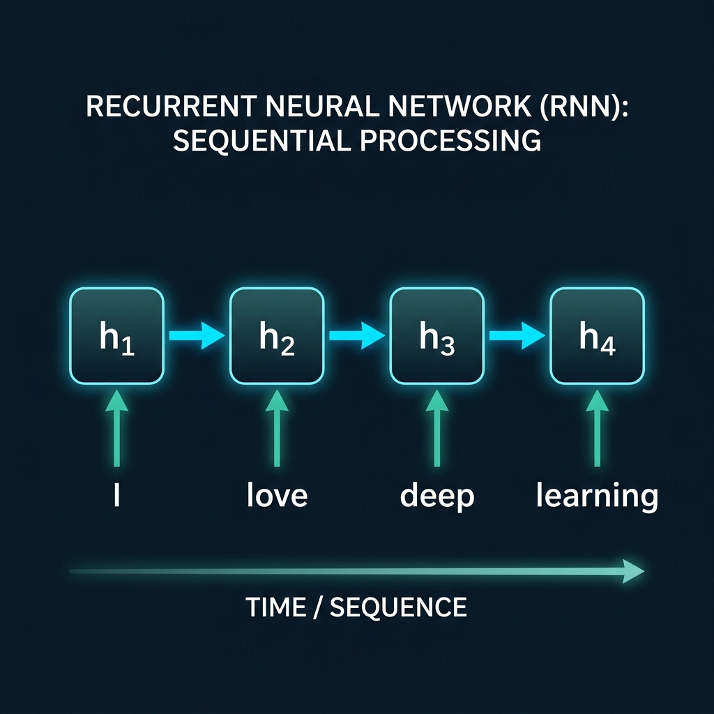
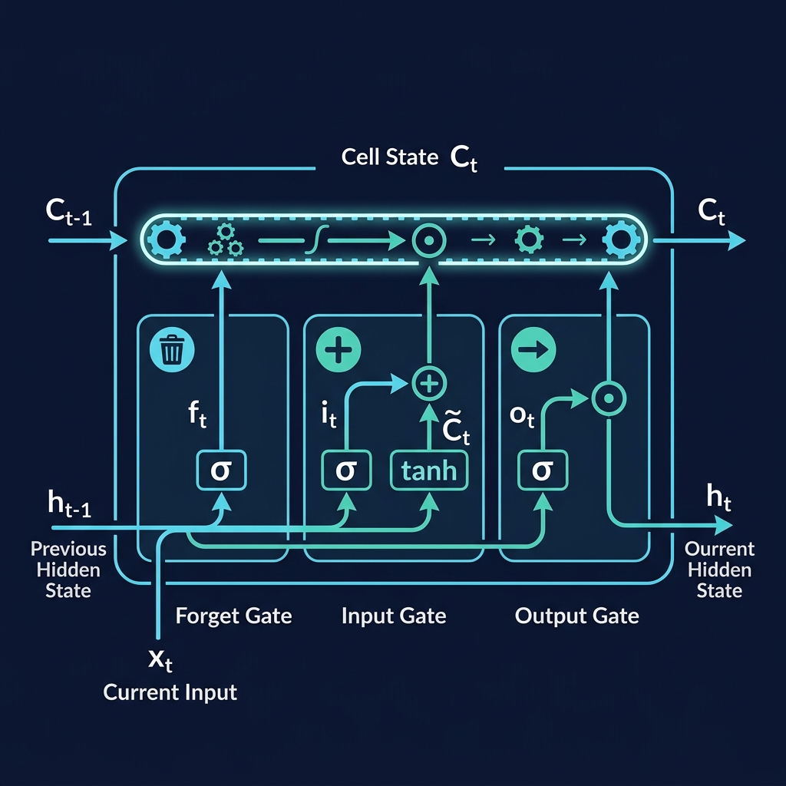
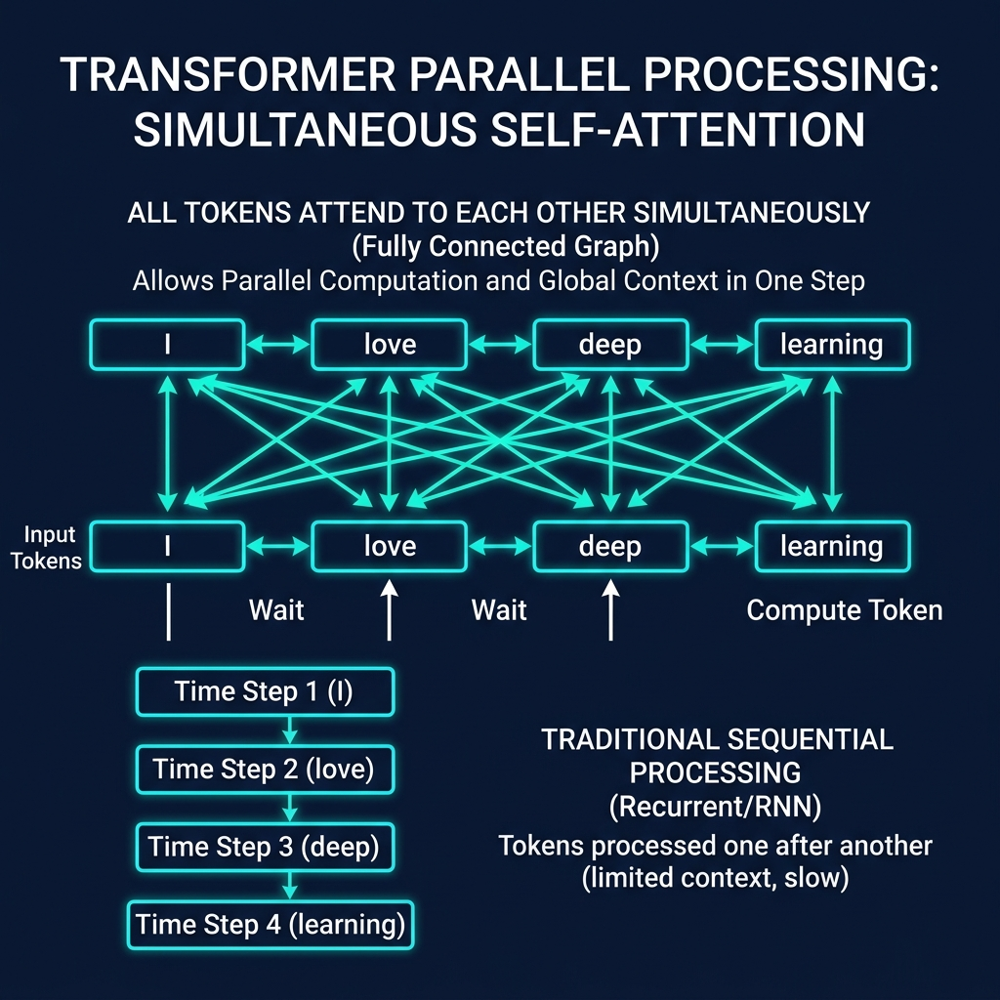
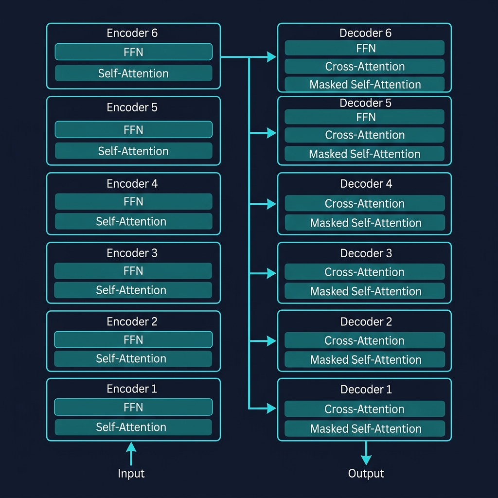
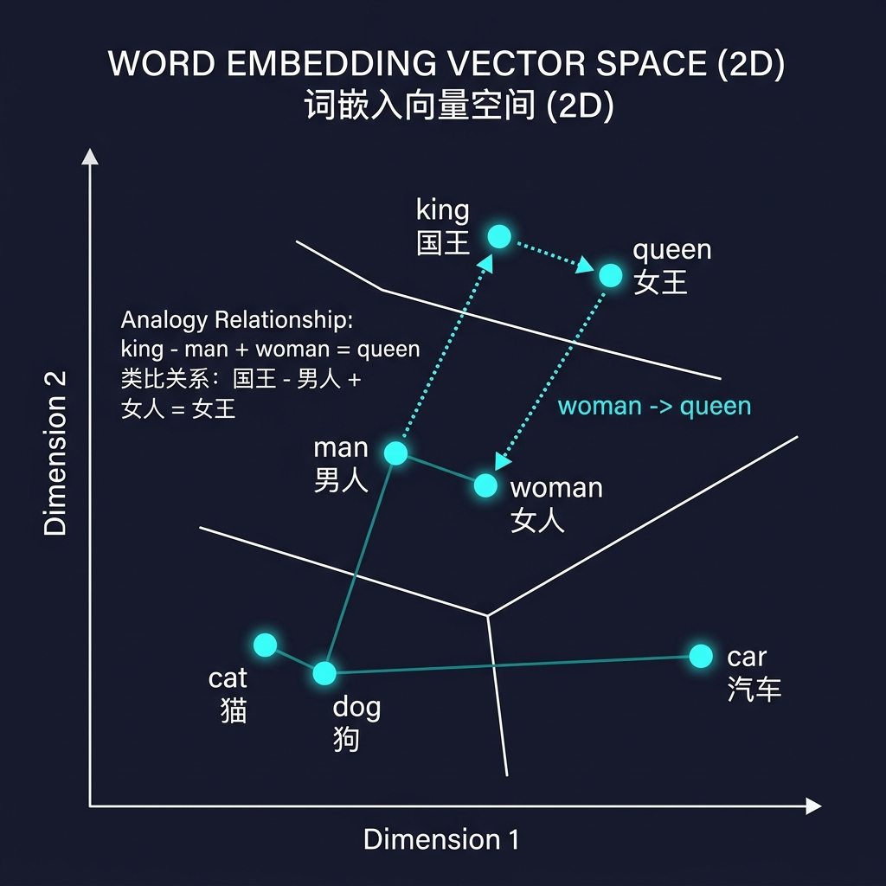

这是 **Transformer 原理系列**的第一篇。整个系列共 5 篇，目标是让你从零开始，彻底搞懂 Transformer 的每一个齿轮是怎么转的。

本篇是全局俯瞰——先看清整座大厦的轮廓，后续再逐层拆解砖瓦。

---

## 在 Transformer 之前：RNN 的困境

2017 年之前，序列建模（处理文本、语音等有先后顺序的数据）的主流是 **RNN（循环神经网络）** 和它的变体 LSTM、GRU。

### RNN 的核心思想：逐词处理

RNN 的工作方式就像你逐字阅读一篇文章：读入第一个词，在脑中形成一个"印象"；再读第二个词，更新这个印象……这个不断更新的"印象"，在 RNN 中叫做 **隐藏状态（Hidden State）**。

> **隐藏状态（Hidden State）**：一个固定长度的向量（可以理解为一组数字），用来浓缩"到目前为止我读过的所有内容"。每读入一个新词，这个向量就会被更新一次。



```
输入:  "我"  →  "爱"  →  "北"  →  "京"
        │        │        │        │
状态:  h₁  →   h₂  →   h₃  →   h₄
      (我)   (我爱)  (我爱北)  (我爱北京)
```

每一步的计算：`新状态 = f(上一步状态, 当前输入词)`。其中 `f` 是一个函数，包含可训练的权重矩阵——模型通过训练来学习这个函数应该怎么更新状态。

### RNN 的三个致命缺陷

**缺陷一：串行处理，无法并行**

处理"爱"之前，必须先处理完"我"——因为需要 h₁ 作为输入。处理"京"之前，必须等前面 3 个字全部处理完。**一个词一个词排队计算，GPU 的几千个核心大部分在闲着。**

> **什么是并行？** GPU 有几千个计算核心，可以同时做几千次计算。但 RNN 的串行依赖让这些核心用不上——就像一条流水线上只开了一个工位。

**缺陷二：长距离依赖衰减**

当处理到句子第 100 个词时，关于第 1 个词的信息已经经过了 99 次状态更新。每次更新都会"稀释"早期信息——就像传话游戏，传了几十个人之后，原话早就面目全非了。

**缺陷三：训练效率极低**

前两个问题叠加的结果：串行无法并行导致硬件利用率低，长距离衰减导致需要更复杂的架构（如 LSTM）来勉强补偿。最终训练一个大规模语言模型需要的时间长到不可接受。

### 📌 LSTM 是怎么缓解长距离问题的？

你可能听说过 **LSTM（Long Short-Term Memory，长短期记忆网络）**，它是 RNN 的改进版本，专门针对"长距离依赖衰减"问题。要理解它的设计，我们先用一个比喻：

> 想象你在读一本小说。普通 RNN 就像只有"工作记忆"——脑子里只能装当前的内容，读到后面就忘了前面。而 LSTM 在工作记忆之外，额外加了一个"笔记本"（**Cell State，细胞状态**），可以把重要信息记下来，长期保留。



LSTM 通过三个"门"来控制信息的流动：

**1. 遗忘门（Forget Gate）—— "该忘记什么？"**

读到新内容时，决定笔记本里哪些旧信息不再需要了。比如读到"小明到了北京"，之前记录的"小明在上海"就可以擦掉了。

```
遗忘门 = sigmoid(当前输入, 上一步状态)
输出 0~1 之间的值：0 = 完全遗忘，1 = 完全保留
```

> **sigmoid 函数**：把任意数字压缩到 0 到 1 之间的函数。输出接近 0 表示"关闭/拒绝"，接近 1 表示"打开/通过"。在这里就像一个开关的旋钮。

**2. 输入门（Input Gate）—— "该记住什么新信息？"**

决定当前输入中哪些新信息值得写入笔记本。不是所有输入都重要——"嗯""啊"这样的词可能就不需要记录。

```
输入门 = sigmoid(当前输入, 上一步状态)  ← 决定写不写
候选内容 = tanh(当前输入, 上一步状态)   ← 决定写什么
```

> **tanh 函数**：把数字压缩到 -1 到 1 之间。它生成的是"候选内容"——可能被写入笔记本的新信息。

**3. 输出门（Output Gate）—— "该输出什么？"**

笔记本里记了很多东西，但当前任务不一定都用得上。输出门决定从笔记本中取出哪些信息，作为当前步的输出。

```
输出门 = sigmoid(当前输入, 上一步状态)
当前输出 = 输出门 × tanh(更新后的笔记本)
```

**LSTM 的核心巧思**在于：Cell State（笔记本）上面的信息流动是**加法操作**，不像普通 RNN 那样反复做矩阵乘法。加法操作让**梯度**（训练时指导参数调整方向的信号）可以更顺畅地回传，大大缓解了信息衰减问题。

> **但请注意：LSTM 只是"缓解"，不是"解决"。** 在上百个词的长文本中，LSTM 仍然力不从心。而且它依然是串行处理，无法并行——这个根本问题没有改变。

---

## Transformer 的核心思想：把"排队"变成"开会"

2017 年，Google 团队在论文 *"Attention is All You Need"* 中提出了 Transformer。核心思想一句话：

> **不要一个词一个词地处理，让所有词同时"看到"彼此。**

RNN 中，信息传递是"接力赛"——每个词只能看到前一个词传过来的状态。
Transformer 中，信息传递是"圆桌会议"——每个词可以直接和句子中的**任何**其他词对话。



这个"让每个词直接看到所有其他词"的机制，就叫 **Self-Attention（自注意力）**。这是 Transformer 最核心的创新，我们会在第二篇详细拆解。

这个设计一举解决了 RNN 的三个问题：

| RNN 的问题 | Transformer 的解决方案 |
|-----------|---------------------|
| 串行处理，GPU 空转 | 所有词并行处理，GPU 满载 |
| 长距离信息衰减 | 任意两词直接对话，不管距离多远 |
| 训练慢 | 并行 + 直接连接 = 训练速度飞跃 |

---

## 整体架构鸟瞰

Transformer 的原始架构是一个 **Encoder-Decoder（编码器-解码器）** 结构。

### 黑箱视角

把 Transformer 想象成一个翻译机：输入法语，输出英语：

```
"Je suis étudiant"  →  [ Transformer ]  →  "I am a student"
```

### 打开黑箱



里面有两个核心部件：

- **Encoder（编码器）**：负责"理解"输入。它读入整个输入句子，生成一组向量，浓缩了输入的全部语义。
- **Decoder（解码器）**：负责"生成"输出。它参考 Encoder 的理解结果，一个词一个词地生成输出。

> **向量（Vector）**：就是一组有序的数字。比如 `[0.21, 0.87, 0.34]` 就是一个 3 维向量。在深度学习中，我们用向量来表示各种信息——一个词的含义、一个句子的语义、一张图片的特征等等。维度越高（数字越多），能表达的信息就越丰富。

### 堆叠结构

Encoder 和 Decoder 各堆了 **6 层**（原始论文设定，不是一个"魔法数字"，可以调整）：

```
        输入                                    输出
         │                                       ▲
    ┌────┴────┐                             ┌────┴────┐
    │Encoder 6│ ──── 理解结果传递 ────→    │Decoder 6│
    ├─────────┤                             ├─────────┤
    │Encoder 5│                             │Decoder 5│
    ├─────────┤                             ├─────────┤
    │Encoder 4│                             │Decoder 4│
    ├─────────┤                             ├─────────┤
    │Encoder 3│                             │Decoder 3│
    ├─────────┤                             ├─────────┤
    │Encoder 2│                             │Decoder 2│
    ├─────────┤                             ├─────────┤
    │Encoder 1│                             │Decoder 1│
    └────┬────┘                             └────┬────┘
         │                                       │
    输入 Embedding                          输出 Embedding
    + 位置编码                              + 位置编码
```

**为什么要堆叠？** 就像读一篇文章：第一遍抓关键词，第二遍理解句意，第三遍把握段落关系……每一层在前一层的基础上做更深层的理解。

关键点：**6 层结构完全相同，但权重不共享**——同一张蓝图造出的 6 台不同机器，各自学到不同的"理解能力"。

> **权重（Weight）**：每层 Encoder 内部的 Self-Attention 和 FFN 都包含一些**可训练的参数矩阵**——这就是"权重"。比如 Self-Attention 需要三个矩阵（W_Q、W_K、W_V）来决定"怎么关注其他词"，FFN 需要两个矩阵来做非线性变换。"权重不共享"意味着：第 1 层的这些矩阵和第 2 层的是**完全独立**的，各自通过训练学到不同的数值，因此每一层学会关注不同层面的语言特征。这些权重矩阵具体是什么、怎么工作的，会在第二篇（Self-Attention）和第四篇（FFN）中详细拆解。

---

## 数据流总览

现在追踪一个句子在 Transformer 中的完整旅程。

### 第一站：Tokenizer（分词器）

文本是字符串，计算机需要数字。Tokenizer 把文本切成 **Token（标记）**，用数字 ID 表示：

```
"I am a student" → ["I", "am", "a", "student"] → [101, 437, 28, 2931]
```

> **Token**：模型处理文本的最小单位。它不一定是一个完整的"词"——可能是子词、字符、甚至标点符号。具体怎么切分，取决于分词算法（后面有 BPE 的详细解释）。
>
> **为什么用数字 ID？** 因为计算机和 GPU 只能做数学运算，不认识文字。所以需要给每个 Token 分配一个数字编号（ID）。这个 ID 本身没有语义含义（101 和 102 的含义可能毫无关系），它只是一个**索引**——用来到 Embedding 查找表里查出对应的语义向量（下一步会讲）。至于 ID 怎么分配：BPE 训练完词表后，每个子词在词表中占一行，**行号就是 ID**。先加入词表的排前面，后合并的排后面，编号顺序本身没有任何含义。

### 第二站：Embedding（词嵌入）

光有数字 ID 不够——101 和 102 数值只差 1，对应的词可能毫无关系。**Embedding 层**把每个 ID 转换成一个高维向量（如 512 维），能捕捉词的语义信息：

```
Token IDs:  [101,     437,     28,      2931]
              │         │        │         │
Embedding:  [0.21,   [0.85,   [0.12,   [0.42,
             0.87,    0.13,    0.94,    0.67,
             ...      ...      ...      ...
             0.34]    0.72]    0.55]    0.19]
            512维     512维     512维    512维
```

关于 Embedding 为什么能表示语义，后面有专门的深度小节。

### 第三站：位置编码（Positional Encoding）

Self-Attention 是"圆桌会议"，所有词同时看彼此。但 **"我爱你"和"你爱我"含义完全不同**——只有 Embedding 的话，模型分不清这两句话。

所以 Transformer 在 Embedding 上**叠加**一个位置编码，告诉模型每个词的位置：

```
最终输入 = Embedding(词的语义) + PositionalEncoding(词的位置)
```

> 位置编码的具体设计（Sinusoidal、RoPE 等）会在第三篇详细展开。现在只需知道：**Transformer 本身对词序"无感"，需要额外注入位置信息。**

### 第四站：穿过 Encoder Stack

带有位置信息的向量进入 6 层 Encoder。每一层做两件事：

```
每层 Encoder 内部：

输入向量 ──→ [ Self-Attention ] ──→ Add & Norm ──→ [ FFN ] ──→ Add & Norm ──→ 输出
              每个词看到所有词                      独立非线性变换
```

> **Self-Attention（自注意力）**：让每个词"关注"句子中所有其他词，根据相关程度更新自己的表示。详见第二篇。
>
> **FFN（前馈神经网络）**：对每个词独立做一次非线性变换——所谓"非线性"，就是让模型能学到复杂的模式，而不只是简单的线性缩放。可以理解为"消化吸收"Attention 收集到的信息。详见第四篇。
>
> **Add & Norm（残差连接 + 层归一化）**：训练稳定性的技巧，防止深层网络训练崩溃。详见第四篇。

经过 6 层后，每个词的向量已经融合了整个句子的上下文。"bank"在"river bank"和"bank account"中会得到截然不同的向量。

### 第五站：Decoder 生成输出

Decoder 生成输出的方式叫做**自回归（Autoregressive）**——一次只生成一个词，然后把生成的词喂回给自己，再生成下一个词。

> **什么是自回归？** "回归"是指输出会"回"到输入中去。具体来说：Decoder 先生成第一个词 "I"，然后把 "I" 加入输入序列，再生成第二个词 "am"，然后把 "I am" 加入输入……如此循环，直到生成结束标记。就像你写作文：写完一个字，看一眼已经写的内容，再决定下一个字写什么。
>
> **那"生成一个词"具体是怎么发生的？** 每一步，Decoder 会输出一个向量，这个向量经过计算后变成词表中每个词的概率——比如 "student" 的概率是 85%，"teacher" 是 8%……然后选概率最高的那个词作为本步的输出。具体过程见下方"第六站：输出概率分布"。

```
Step 1:  <开始>                    → Decoder → "I"
Step 2:  <开始> "I"                → Decoder → "am"
Step 3:  <开始> "I" "am"           → Decoder → "a"
Step 4:  <开始> "I" "am" "a"       → Decoder → "student"
Step 5:  <开始> "I" "am" "a" "student" → Decoder → <结束>
```

每一步，Decoder 做三件事：

**1. Masked Self-Attention（带掩码的自注意力）**

输入**只有** Decoder 端已经生成的词（经过 Embedding + 位置编码后的向量），**不包含 Encoder 那边的原文**。比如在上面 Step 3 中，输入就是 `<开始> "I" "am"` 这三个词的向量，而源语言 "Je suis étudiant" 的信息在这一步完全不参与——它要等到下一步 Cross-Attention 才传进来。Masked Self-Attention 让这些已生成的词互相看、互相交流，但有一个关键限制：**不能偷看还没生成的词**。比如在生成 "am" 的时候，Decoder 只能看到 `<开始>` 和 "I"，不能看到后面的 "a" 和 "student"——因为它们还没生成呢。这就像考试时只能看已经答过的题，不能翻到后面偷看。这个"禁止偷看"的限制就是通过 **Mask（掩码）** 实现的。

**2. Cross-Attention（交叉注意力）**

这一步是 Decoder 和 Encoder 之间的"对话"。具体机制是：Decoder 拿着当前已生成的内容，去给 Encoder 输出的**每个原文词**打一个"相关度分数"，分数高的词获得更多关注，分数低的词被忽略。

举个翻译的例子。当 Decoder 已经生成了 "I am a"，现在要决定下一个词：

```
Encoder 那边（原文）：  "Je"   "suis"   "étudiant"
                          │       │          │
相关度分数：             0.05    0.10       0.85
                                              ↑
                                    Decoder 重点关注这个词！
```

Decoder 发现 "étudiant"（学生）和当前位置最相关（分数 0.85），于是重点提取它的语义信息，最终生成 "student"。

**简单说：Self-Attention 看的是"自己已经写了什么"，Cross-Attention 看的是"原文说了什么"。** 前者帮助保持输出的连贯性，后者帮助保持翻译的忠实性。

> **如果要生成的词在原文中找不到对应呢？** 比如翻译 "Je suis étudiant" → "I am **a** student"，这个 "a" 在法语原文中没有对应词。没关系——Decoder 生成的词**不是从输入里"挑"的，而是从整个词表（30,000 个词）里根据概率"选"的**。Cross-Attention 只是帮 Decoder 理解原文的意思，最终选哪个词是由 Decoder 综合所有信息后自己决定的。模型在训练中学会了英语需要冠词 "a"，即使法语原文没有。

**3. FFN（前馈神经网络）**

对每个词独立做一次非线性变换。你可以理解为：前两步 Attention 负责"收集信息"（从已生成的词和原文中），FFN 负责"消化吸收"这些信息，提炼出最终的特征表示。

> 以上三个组件的详细原理会在第二篇（Self-Attention / Cross-Attention）和第四篇（Mask / FFN）中深入拆解。

### 第六站：输出概率分布

Decoder 最后输出一个向量，经过 **Linear 层** 和 **Softmax** 转换成概率：

> **Linear 层（线性层）**：本质就是一次矩阵乘法，作用是改变向量的维度。这里它把 Decoder 输出的 512 维向量"投影"到 30,000 维（词表大小），让每一维对应一个词的"得分"。得分越高，说明模型越认为应该生成这个词。Linear 层的具体原理会在第四篇展开。
>
> **Softmax**：把一组任意数字转换成"概率分布"——所有值都在 0~1 之间，且加起来等于 1。数值越大的项，转换后概率越高。

```
Decoder 输出 [512维] → Linear [512→30000] → Softmax → 概率分布

  "student": 0.85  ← 最高，选它
  "teacher": 0.08
  "I":       0.002
  ...其余 29,997 个词的概率都很小
```

选概率最高的词作为输出，就是 **贪心解码（Greedy Decoding）**——每步都选当前最优。还有更复杂的解码策略（如 Beam Search），第五篇会讲。

---

## 📌 深入理解：Embedding 为什么能表示语义？

一个 512 维的数字向量，怎么就能表示一个词的"含义"？

### One-Hot 的困境

最朴素的方式是 **One-Hot 编码**：词表 30,000 个词，每个词用 30,000 维向量表示，只有自己的位置是 1，其余全是 0。

```
"猫"  = [0, 0, ..., 1, ..., 0]  （第 5287 位是 1）
"狗"  = [0, 0, ..., 0, 1, ..., 0]  （第 8103 位是 1）
"汽车" = [0, 0, ..., 0, ..., 1, 0]  （第 21456 位是 1）
```

问题：**"猫"和"狗"的距离 = "猫"和"汽车"的距离。** 所有词之间的距离都一样，完全丢失了语义关系。而且 30,000 维的稀疏向量极其浪费。

### 分布式假设

语言学中有一个核心假设：

> **"You shall know a word by the company it keeps."**
> 一个词的含义，由它经常出现的上下文决定。

"猫"和"狗"经常出现在相似的上下文中（"可爱的___"、"养了一只___"、"___在沙发上"），所以它们的语义相似。"猫"和"汽车"几乎不会出现在相同上下文里，所以语义不同。

### Embedding 的训练

Embedding 矩阵本质是一个**查找表**，形状 `[词表大小 × 向量维度]`（如 `[30000 × 512]`）。它的训练过程是这样的：

**第一步：随机初始化。** 一开始，查找表里的数字全是随机填的。这时候"猫"的向量和"狗"的向量没有任何关系，完全是乱的。

**第二步：给模型出题。** 训练时，我们给模型看一段文本的前几个词，让它预测下一个词是什么。比如：

```
输入: "今天天气真"  →  模型预测: "？"
正确答案: "好"
```

**第三步：对答案，调参数。** 如果模型猜错了（比如猜成了"坏"），就计算误差，然后**反向调整所有相关参数**——包括 Embedding 查找表里的数字。经过成千上万次这样的"出题→对答案→调参数"循环后，出现在相似上下文中的词（比如"猫"和"狗"都常出现在"可爱的___"后面），它们在查找表中的向量就会被逐渐推向相近的位置。

> **梯度**：告诉模型"参数应该往哪个方向调整"的信号。模型预测错误时，梯度会把相关参数推向更正确的方向。



最终效果——向量空间中语义关系被几何关系编码：

```
"国王" - "男人" + "女人" ≈ "女王"
"巴黎" - "法国" + "德国" ≈ "柏林"
```

**Embedding 不是人为设计的特征，而是模型在海量文本中自动学到的语义压缩表示。**

---

## 📌 深入理解：BPE 分词 —— Tokenizer 到底在干什么？

Transformer 数据流的第一步就是分词。这个"切法"直接决定了模型能看到什么。

### 两种极端的切法

**按字符切（Character-level）：**
```
"unhappiness" → ["u","n","h","a","p","p","i","n","e","s","s"]  （11个Token）
```
- ✅ 不会遇到未知词
- ❌ 序列太长，模型要自己学 "un-" 是否定前缀
- ❌ 单个字符携带的信息太少

**按词切（Word-level）：**
```
"unhappiness" → ["unhappiness"]  （1个Token）
```
- ✅ 每个 Token 信息丰富
- ❌ 词表爆炸（英语几十万个词）
- ❌ 新词、拼写错误全变成 `<UNK>`（未知）

### BPE：黄金平衡

**BPE（Byte Pair Encoding，字节对编码）** 从字符开始，反复合并出现频率最高的相邻对，直到词表达到预设大小。

用一个完整的例子走一遍。假设我们的训练语料中只有以下 4 个词：

```
"low"    出现 5 次
"lower"  出现 2 次
"newest" 出现 6 次
"widest" 出现 3 次
```

**第一步：把所有词拆成字符**

每个词用空格分隔字符，末尾加一个特殊标记 `_` 表示词尾：

```
l o w _        ×5
l o w e r _    ×2
n e w e s t _  ×6
w i d e s t _  ×3
```

此时词表 = `{l, o, w, e, r, n, s, t, d, i, _}`（11 个字符）

**第二步：统计所有相邻字符对的出现频率**

扫描所有词，数每种相邻对出现了多少次：

```
(e, s): 在 "newest" 中出现 ×6，在 "widest" 中出现 ×3 → 共 9 次
(s, t): 在 "newest" 中出现 ×6，在 "widest" 中出现 ×3 → 共 9 次
(t, _): 共 9 次
(l, o): 在 "low" 中出现 ×5，在 "lower" 中出现 ×2 → 共 7 次
(o, w): 同上 → 共 7 次
...其他对频率更低
```

这里 `(e, s)`、`(s, t)`、`(t, _)` 三对都是 9 次，出现了**平局**。怎么办？BPE 的实际实现中，平局时会按某种固定顺序选一个（比如字典序、首次出现顺序等），不同实现可能不同。**选谁不影响最终词表的质量**——因为其他的对在下一轮还会被合并。这里我们选 `(e, s)` 继续演示。

**第三步：合并频率最高的对**

`(e, s)` 被选中。把所有 `e s` 合并为一个新 Token `es`：

```
l o w _          ×5
l o w e r _      ×2
n e w es t _     ×6    ← e和s合并成了es
w i d es t _     ×3    ← 同上
```

词表新增 `es` → 现在 12 个 Token。

**第四步：重复——再统计、再合并**

现在 `(es, t)` 出现 9 次最高，合并：

```
n e w est _      ×6    ← es和t合并成了est
w i d est _      ×3
```

词表新增 `est` → 13 个 Token。

继续。`(l, o)` 出现 7 次最高，合并：

```
lo w _           ×5    ← l和o合并成了lo
lo w e r _       ×2
```

词表新增 `lo` → 14 个 Token。

下一轮 `(lo, w)` 出现 7 次，合并为 `low`：

```
low _            ×5
low e r _        ×2
```

词表新增 `low` → 15 个 Token。

**如此反复，直到词表大小达到预设值**（比如 30,000）。

**最终效果——分词时的应用：**

训练好的 BPE 会记住所有合并规则。遇到新文本时，按同样的规则切分：

```
"lowest" → ["low", "est"]
  ↑ 词根被识别     ↑ 后缀被识别（虽然训练语料没有 "lowest" 这个词！）

"unhappiness" → ["un", "happi", "ness"]
  ↑ 否定前缀        ↑ 词根        ↑ 名词后缀

"ChatGPT" → ["Chat", "G", "PT"]
  ↑ 即使是全新的词，也不会变成 <UNK>，而是被拆成模型认识的子词
```

> **核心思想**：高频的字符组合会被合并成一个 Token（比如 "est"、"low"），低频的词会被拆成多个子词。这样既不会有未知词问题，序列长度也不会太长。

BPE 让模型自动发现了语言的构词规律（前缀、后缀、词根），在 OOV 问题和序列长度之间取得了最佳平衡。

| 模型 | 分词方法 | 词表大小 |
|------|---------|---------|
| GPT-2 | BPE | 50,257 |
| GPT-4 | BPE | 100,256 |
| LLaMA 3 | BPE | 128,256 |
| BERT | WordPiece（BPE 变体） | 30,522 |

---

## 每层内部结构预览 & 系列地图

最后，总览每层的组件，以及后续四篇分别会展开哪些内容。

### Encoder 层

| 组件 | 一句话解释 | 详见 |
|------|----------|------|
| Self-Attention | 每个词看到所有其他词，收集上下文信息 | 第二篇 |
| Multi-Head | 把 Attention 拆成多个"头"，从不同角度关注 | 第三篇 |
| Positional Encoding | 注入词的位置信息（Sinusoidal / RoPE） | 第三篇 |
| Add & Norm | 残差连接 + 层归一化，保证训练稳定 | 第四篇 |
| FFN | 对每个词独立做非线性变换，"消化"信息 | 第四篇 |

### Decoder 层

| 组件 | 一句话解释 | 详见 |
|------|----------|------|
| Masked Self-Attention | 同 Self-Attention，但不能看未来（防作弊） | 第二、四篇 |
| Cross-Attention | Decoder 去查看 Encoder 的理解结果 | 第二篇 |
| FFN | 同 Encoder | 第四篇 |

### 系列全览

| 篇目 | 主题 | 核心内容 |
|------|------|---------|
| **第一篇（本篇）** | 全局观 | 架构鸟瞰、数据流、Embedding、BPE |
| **第二篇** | Self-Attention | Q、K、V 是什么、缩放因子 √d_k 的数学证明、Attention 复杂度 |
| **第三篇** | Multi-Head + 位置编码 | 多头注意力的参数量、从 Sinusoidal 到 RoPE 的进化 |
| **第四篇** | 砖与瓦 | Residual、LayerNorm、FFN、Causal Mask、Decoder-only 架构 |
| **第五篇** | 训练到推理 | 损失函数、KV Cache、MQA/GQA、Flash Attention |

---

## 小结

本篇建立了 Transformer 的全局直觉：

1. **为什么要 Transformer**：RNN/LSTM 串行处理、长距离衰减、训练慢。Transformer 用 Self-Attention（"圆桌会议"）替代串行处理，实现并行化和直接长距离连接。

2. **LSTM 的门机制**：通过遗忘门、输入门、输出门控制信息流动，用 Cell State 缓解长距离衰减——但仍是串行的，治标不治本。

3. **整体架构**：Encoder-Decoder 结构，各 6 层。Encoder 理解输入，Decoder 生成输出。

4. **数据流**：文本 → Tokenizer（BPE 分词）→ Embedding（语义向量）→ 加位置编码 → 6 层 Encoder → 6 层 Decoder → Linear + Softmax → 输出。

5. **Embedding** 通过训练自动学习语义关系；**BPE** 在字符级和词级之间找到了平衡。

**下一篇**，我们将深入 Transformer 最核心的创新——**Self-Attention 自注意力机制**：Q、K、V 到底是什么？为什么要分三个矩阵？缩放因子 √d_k 背后的数学推导是什么？

---

*本系列参考：[The Illustrated Transformer](https://jalammar.github.io/illustrated-transformer/) by Jay Alammar（CC BY-NC-SA 4.0）*
